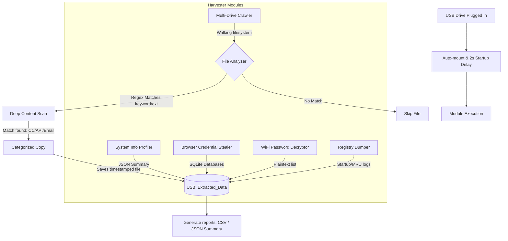

# USB Data Extractor & Info-Stealer Suite

This repository simulates the evolutionary timeline of a USB-based data exfiltration and post-exploitation intelligence harvesting suite. It maps the step-by-step development of Python payloads starting from a compliance auditing tool (v1) to an advanced, multi-threaded, silent system harvesting framework (v5). 

> [!WARNING]
> This codebase is designed for educational, research, and authorized auditing purposes only. Safe usage guidelines and virtual sandboxes should always be employed when testing these utilities.

---

## Description
The **USB Data Extractor Suite** highlights the security risks associated with physical USB payloads and untrusted executables. As security policies restrict standard network exfiltration vectors, malicious actors often rely on physical access scripts. 

Through the versions included in this suite:
- **v1 to v3** trace the automation of simple file-copy scripts.
- **v4** demonstrates compiling scripts into silent Windows binaries.
- **v5** represents a modern info-stealer that automatically intercepts system profiles, network keys, registry configuration hives, browser databases, and scans document contents for sensitive patterns like API keys or financial information.

---

## Screenshots / Demo
[V2 extractor](./static/v2%20extractor.png)

### Operational Flow Diagram (v5)



### Typical Folder Output Structure (Post-Extraction)
```text
Extracted_Data/
├── Archives/
│   └── 20260716_120000_confidential_backup.zip
├── Browser_Data/
│   ├── Chrome/
│   │   └── Login Data
│   └── browser_summary.json
├── Configurations/
│   └── 20260716_120000_config.xml
├── Credentials/
│   └── 20260716_120000_passwords.txt
├── Databases/
│   └── 20260716_120000_users.db
├── Network/
│   └── wifi_passwords.json
├── Registry/
│   └── Run.txt
├── System_Info/
│   ├── hosts.txt
│   └── system_info.json
├── extracted_files.csv
└── extraction_report.json
```

---

## Features

- **Version 1 (Auditor):** Standard console logging, authorization confirmation check, and localized scope limits.
- **Version 2 (USB Portable):** Dynamic drive letter discovery, custom walk depth configuration via external `config.json`, and legacy AutoRun configuration generation.
- **Version 3 (Weaponized):** Complete automation (zero user prompts), skips Windows operating system folders, crawls all logical drive volumes, and groups exfiltrated files into categories.
- **Version 4 (Concealed Executable):** Built-in batch compilation scripts for PyInstaller, completely hidden window console loop, and loop protection to prevent scanning its own target folders.
- **Version 5 (All-in-One Harvester):**
  - **Browser Database Stealer:** Copies active SQLite credentials, cookies, and search history from Google Chrome, Microsoft Edge, Firefox, Brave, and Opera.
  - **WiFi Password Decryptor:** Automatically queries the system database using `netsh` and saves cleartext keys.
  - **Registry Hive Exporter:** Dumps recent files (`RecentDocs`), startup routines (`Run`), and location registries to files.
  - **Deep File Content Inspector:** Scans the first 50KB of files searching for raw email structures, URL targets, credit cards, IP addresses, and private key/token headers using regular expressions.
  - **Comprehensive Auditing Reports:** Compiles detailed CSV indices and structured JSON reports containing machine metadata, telemetry, and file hashes.

---

## Tech Stack
- **Language:** Python 3.x
- **Build Utilities:** PyInstaller (for executable packaging)
- **Windows System Interface:** Native Windows Registry API (`winreg`), Windows Script Host (`WScript.Shell`)
- **Command Shell Interface:** Network Shell CLI (`netsh`)
- **Key Python Libraries:** `sqlite3`, `re`, `shutil`, `hashlib`, `json`, `ctypes`

---

## Project Architecture

The core harvesting script follows a segmented modular pipeline:

```
[Start Engine] ➔ [USB Path Verification & Directory Creation]
                     │
                     ├─➔ [System & Environment Profiler]
                     ├─➔ [Browser Data Exfiltrator (Chrome/Edge/FF/Brave/Opera)]
                     ├─➔ [WiFi Configuration Plaintext Decryptor]
                     ├─➔ [Registry Settings Dumper]
                     │
                     └─➔ [File System Search Loop]
                           │
                           └─➔ [Rule Filter: Extension/Keyword/Size Checks]
                                 │
                                 └─➔ [Deep Regex Scan: CC/Emails/APIs]
                                       │
                                       └─➔ [Timestamped Copy & Log Generation]
```

---

## Installation

1. Copy or clone the project files to a designated environment.
2. Install packaging utilities (optional, required for compiling V4 binaries):
   ```cmd
   pip install pyinstaller
   ```

---

## Configuration

For **Version 2**, settings are managed through `config.json` located in the root directory:
```json
{
  "target_drive": "D:\\",
  "max_depth": 3,
  "auto_run": true,
  "stealth_mode": false,
  "last_run": "2026-02-02T16:02:48.331151",
  "scan_all_drives": false,
  "exclude_dirs": [
    "Windows",
    "Program Files",
    "Program Files (x86)",
    "$Recycle.Bin"
  ]
}
```
For **Versions 3, 4, and 5**, configuration variables (extensions, keywords, system folders, and size limits) are consolidated directly inside the scripts to simplify execution.

---

## Usage

### Running Scripts (Python Mode)
To run the files directly in Python:
- **Version 1 (Auditor):**
  ```cmd
  python data_extracter.py
  ```
  *(Or execute via `launcher.vbs` to verify execution parameters)*
- **Version 2 (USB Portable):**
  ```cmd
  python data_extracter_v2.py
  ```
- **Version 3 (Weaponized):**
  ```cmd
  python data_extracter_v3.py
  ```
- **Version 5 (Harvester):**
  ```cmd
  python v5/v5.py
  ```
  *(Or launch `v5/run_extract.bat`)*

### Running Binaries (Standalone EXE Mode)
To compile Version 4 to a standalone executable:
1. Navigate to the `v4` directory and run:
   ```cmd
   build_exe.bat
   ```
2. Once complete, copy `dist\USB_Audit_Tool.exe` to a USB drive.
3. Plug the USB into a target machine and run `USB_Audit_Tool.exe`. It will execute silently in the background and output harvested files to the `auditlogs/` folder on the USB drive.

---

## Folder Structure

```
info_stealer/
├── audit_log.json            # Tracking log of past runs
├── autorun.inf               # Dynamic AutoRun script
├── config.json               # Settings file (V2 configuration)
├── data_extracter.py         # Version 1 (Polite Auditor)
├── data_extracter_v2.py      # Version 2 (Portable USB Tool)
├── data_extracter_v3.py      # Version 3 (Weaponized Script)
├── launcher.vbs              # Background launcher helper script
├── version_comparison.md     # Progression comparison of all versions
├── readme.md                 # Project documentation
├── v4/                       # Version 4 files
│   ├── data_extracter_v4.py  # Invisible background execution script
│   ├── build_exe.bat         # Standalone batch compiler
│   └── USB_Audit_Tool.spec   # Spec file generated by PyInstaller
└── v5/                       # Version 5 files
    ├── v5.py                 # Advanced harvesting payload script
    └── run_extract.bat       # Execution helper script
```

---

## Security Features

- **Loop Evading:** Detects the current working directory to identify the USB drive letter and automatically excludes it from the scanning walk to avoid infinite recursion loops.
- **Window Hiding:** Supports GUI suppression. The compiled V4 executable runs in a detached thread with no active terminal UI (`--noconsole`).
- **Disk Evasion:** Skips major system directories (`Windows`, `Program Files`, `Program Files (x86)`, `AppData`, etc.) to prevent file system lag, avoid triggering security monitoring logs, and keep execution fast.
- **Silent Exception Handling:** All main search iterations are wrapped in generic `try-except` statements. Locked database files or permissions-blocked system folders will be skipped silently instead of halting script execution.
- **Hidden Attributes:** Uses `ctypes` bindings to set files like `autorun.inf` to system-hidden, reducing visual footprint on standard drives.

---

## Testing

> [!IMPORTANT]
> When testing the scripts or executables, ensure you comply with the following:
- **Sandbox Environment:** Run the executables only inside isolated virtual machines (e.g., VMware, VirtualBox, or Windows Sandbox) with network cards disabled.
- **Mock Lab Folder:** Version 1 scans the `D:\CyberLab\SensitiveMock` folder by default. Create this directory structure and populate it with sample txt/pdf documents to verify the script.

---

## Future Improvements

1. **Remote Telemetry Exfiltration:** Transition from saving files to a local USB directory to sending harvested credentials and reports directly to a secure HTTP POST API or webhook.
2. **Encrypted Output Staging:** Cryptographically encrypt (e.g., using AES-256) all copied database files and reports on the USB drive to protect findings if the physical media is lost.
3. **Anti-Analysis & VM Detection:** Add pre-execution checks querying RAM size, CPU count, active network adapters, and common virtualization vendor strings (e.g., "VBOX", "VMware") to terminate immediately if analyzed in a sandbox.
4. **Code Obfuscation:** Integrate Python code scramblers like PyArmor into the compilation batch script to prevent simple decompilation of PyInstaller binaries.
